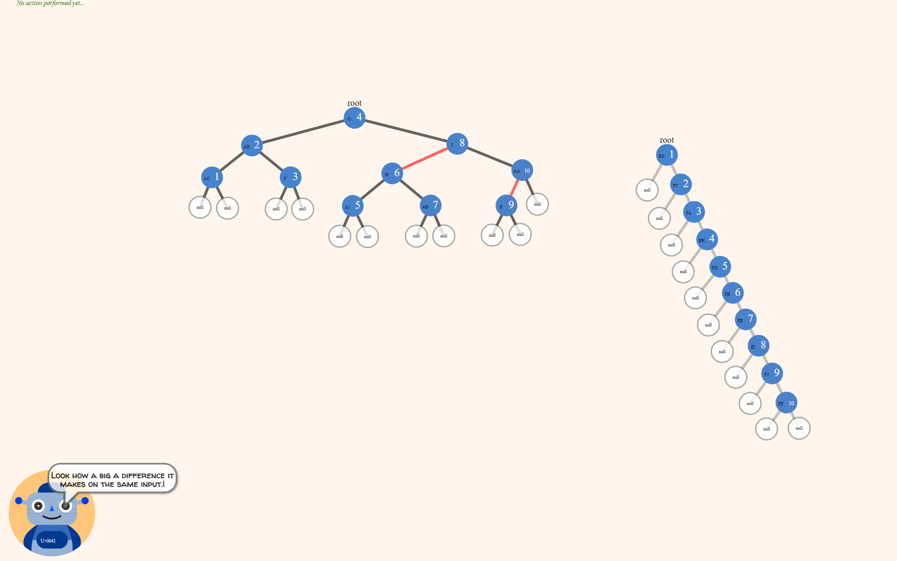

Algorithms with Albot */'ælbɒt/* is a modern interactive visualisation application for algorithms taught in computer science courses.
It can be used to learn about algorithms, explore the underlying mechanisms by controlling input and step-by-step animations. It is a useful tool for solving exercises.

Algorithms with Albot currently has a story mode and a sandbox mode. The story mode goes through and explains Binary Search Trees, touching upon balance, running time and complexity. Whereas the sandbox mode is a free for all. 

## Screenshots

## Documentation

-   [Structure](./.docs/structure.md)
-   [Components](./.docs/Components.md)
-   [Handlers](./.docs/handlers.md)
-   [Utilities](./.docs/utilities.md)

## User Guide

Here there will be a short guide on how to create your own "level"
